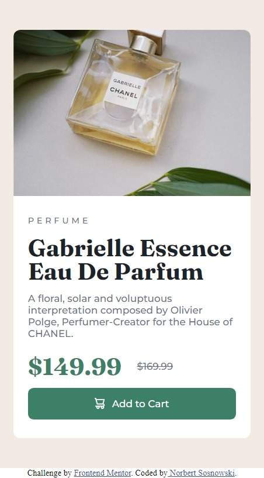
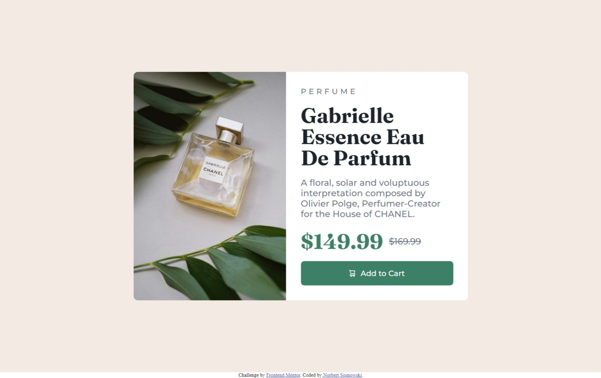

# Frontend Mentor - Product preview card component solution

This is a solution to the [Product preview card component challenge on Frontend Mentor](https://www.frontendmentor.io/challenges/product-preview-card-component-GO7UmttRfa). Frontend Mentor challenges help you improve your coding skills by building realistic projects.

## Table of contents

- [Overview](#overview)
  - [The challenge](#the-challenge)
  - [Screenshot](#screenshot)
  - [Links](#links)
- [My process](#my-process)
  - [Built with](#built-with)
  - [What I learned](#what-i-learned)
  - [Continued development](#continued-development)
  - [Useful resources](#useful-resources)
- [Author](#author)

## Overview

### The challenge

Users should be able to:

- View the optimal layout depending on their device's screen size
- See hover and focus states for interactive elements

### Screenshot

Screenshot mobile


Screenshot desktop


### Links

- Solution URL: [Add solution URL here](https://your-solution-url.com)
- Live Site URL: [Add live site URL here](https://your-live-site-url.com)

## My process

### Built with

- CSS custom properties
- Flexbox
- min() & clamp()
- CSS Grid
- Mobile-first workflow

### What I learned

The biggest challenge in this challenge 🤨 was to make this transition between the mobile and desktop view, especially the image which was stretching the preview downstairs and fitting almost the whole space 🤧

```css
.preview {
  ...
  border-radius: 10px;
  overflow: hidden;
  ...
}
```

I've been looking for so long to find a solution to that. Now I'll use it almost everywhere because of the effect 👌🔥

### Continued development

I think I'll focus on how to use the 'flex-wrap' property because I still don't feel it.

### Useful resources

- [CSS-tricks - responsive images css](https://css-tricks.com/responsive-images-css/) - This helped me for setting the two versions of the same image.

## Author

<!-- - Website - [Norbert Sosnowski](https://www.your-site.com) -->

- Frontend Mentor - [@Eter-NS](https://www.frontendmentor.io/profile/Eter-NS)
- Twitter - [@eter_ns](https://www.twitter.com/eter_ns)
- Linkedin - [Norbert Sosnowski](https://www.linkedin.com/in/norbert-sosnowski-629535197/)
